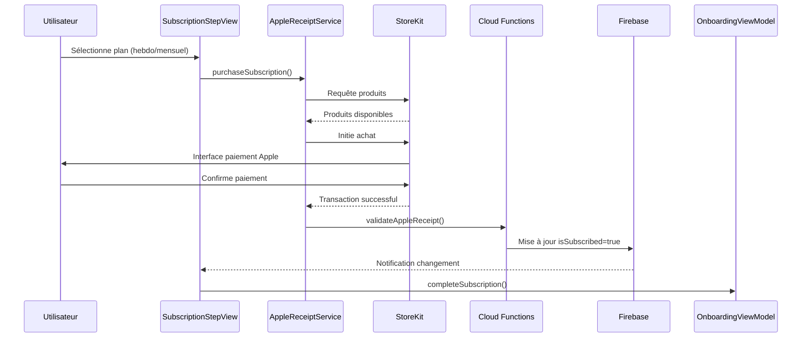
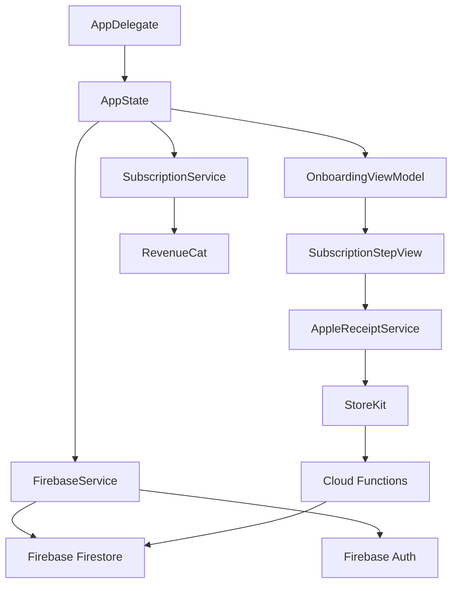

# 📱 Rapport Complet - Système d'Onboarding et de Paiement

## Love2Love iOS App

---

## 🏗️ Architecture Générale

Votre application Love2Love utilise une architecture **MVVM** (Model-View-ViewModel) avec **SwiftUI** pour l'interface utilisateur et **Firebase** comme backend. Le système d'onboarding et de paiement est étroitement intégré avec plusieurs services:

### Services Principaux

- **Firebase Auth** - Authentification utilisateur
- **Firebase Firestore** - Base de données NoSQL
- **Firebase Cloud Functions** - Validation côté serveur
- **StoreKit** - Achats in-app natifs iOS
- **RevenueCat** - Analytics des abonnements
- **Apple Sign-In** - Authentification sécurisée

---

## 🔄 Flux d'Onboarding Complet

### Vue d'ensemble du processus

L'onboarding de votre application comporte **15 étapes distinctes** qui collectent les informations utilisateur avant de proposer l'abonnement premium.

### Étapes d'Onboarding (Ordre Séquentiel)

| Étape | Nom                       | Description                               | Fichier                                 |
| ----- | ------------------------- | ----------------------------------------- | --------------------------------------- |
| 1     | `relationshipGoals`       | Sélection des objectifs de couple         | `RelationshipGoalsStepView.swift`       |
| 2     | `relationshipImprovement` | Points d'amélioration souhaités           | `RelationshipImprovementStepView.swift` |
| 3     | `relationshipDate`        | Date de début de relation                 | `RelationshipDateStepView.swift`        |
| 4     | `communicationEvaluation` | Évaluation de la communication            | `CommunicationEvaluationStepView.swift` |
| 5     | `discoveryTime`           | Temps de découverte du partenaire         | `DiscoveryTimeStepView.swift`           |
| 6     | `listening`               | Qualité d'écoute                          | `ListeningStepView.swift`               |
| 7     | `confidence`              | Niveau de confiance                       | `ConfidenceStepView.swift`              |
| 8     | `complicity`              | Complicité du couple                      | `ComplicityStepView.swift`              |
| 9     | `authentication`          | Sign-in avec Apple                        | `AuthenticationStepView.swift`          |
| 10    | `displayName`             | Nom d'affichage (si non fourni par Apple) | `DisplayNameStepView.swift`             |
| 11    | `profilePhoto`            | Photo de profil                           | `ProfilePhotoStepView.swift`            |
| 12    | `completion`              | Récapitulatif                             | `CompletionStepView.swift`              |
| 13    | `loading`                 | Traitement des données                    | `LoadingStepView.swift`                 |
| 14    | `partnerCode`             | Code de connexion partenaire              | `PartnerCodeStepView.swift`             |
| 15    | `questionsIntro`          | Introduction aux questions                | `QuestionsIntroStepView.swift`          |
| 16    | `categoriesPreview`       | Aperçu des catégories                     | `CategoriesPreviewStepView.swift`       |
| 17    | `subscription`            | **Page de paiement**                      | `SubscriptionStepView.swift`            |

### Gestion des États

```swift
// ViewModels/OnboardingViewModel.swift - Ligne 27
@Published var currentStep: OnboardingStep = .relationshipGoals

// Progression calculée automatiquement
var progressValue: Double {
    let totalSteps = Double(OnboardingStep.allCases.count)
    let currentIndex = Double(OnboardingStep.allCases.firstIndex(of: currentStep) ?? 0)
    return (currentIndex + 1) / totalSteps
}
```

---

## 💳 Système de Paiement

### Architecture du Paiement

Votre système de paiement utilise une **architecture triple validation** :

1. **Client iOS** (StoreKit) - Initie la transaction
2. **Firebase Cloud Functions** - Valide la transaction
3. **App Store Server API** - Vérification finale

### Services de Paiement

| Service                  | Fichier                                 | Responsabilité                   |
| ------------------------ | --------------------------------------- | -------------------------------- |
| `SubscriptionService`    | `Services/SubscriptionService.swift`    | Gestion StoreKit et transactions |
| `AppleReceiptService`    | `Services/AppleReceiptService.swift`    | Validation des reçus Apple       |
| `StoreKitPricingService` | `Services/StoreKitPricingService.swift` | Gestion des prix dynamiques      |

### Produits d'Abonnement

```swift
// Services/SubscriptionService.swift - Ligne 17
private let productIdentifiers: Set<String> = [
    "com.lyes.love2love.subscription.weekly",
    "com.lyes.love2love.subscription.monthly"
]
```

### Flux de Paiement Détaillé



---

## 🔐 Authentification Firebase

### Processus d'Authentification

L'authentification se fait exclusivement via **Apple Sign-In** pour la sécurité et conformité App Store.

```swift
// Services/AuthenticationService.swift
func signInWithApple() {
    // Configuration ASAuthorizationController
    let request = ASAuthorizationAppleIDProvider().createRequest()
    request.requestedScopes = [.fullName, .email]

    // Génération nonce sécurisé
    let nonce = randomNonceString()
    currentNonce = nonce
    request.nonce = sha256(nonce)
}
```

### Intégration Firebase

```swift
// Services/FirebaseService.swift - Ligne 196
Auth.auth().signIn(with: credential) { [weak self] result, error in
    if result?.additionalUserInfo?.isNewUser == true {
        self?.createEmptyUserProfile(...)
    } else {
        self?.loadUserData(uid: firebaseUser.uid)
    }
}
```

---

## 🔄 Gestion d'État Centralisée

### AppState - Hub Central

Le `AppState` coordonne tous les services et états de l'application :

```swift
// ViewModels/AppState.swift
class AppState: ObservableObject {
    @Published var isOnboardingCompleted: Bool = false
    @Published var isAuthenticated: Bool = false
    @Published var currentUser: AppUser?
    @Published var isOnboardingInProgress: Bool = false

    // Services intégrés
    @Published var freemiumManager: FreemiumManager?
    @Published var subscriptionService: PartnerSubscriptionSyncService?
    // ... autres services
}
```

### Cycle de Vie de l'Application

```swift
// App/ContentView.swift - Ligne 14
if appState.isLoading {
    LaunchScreenView()
} else if isTransitioning {
    LoadingTransitionView()
} else if !appState.isAuthenticated {
    AuthenticationView()
} else if appState.isOnboardingCompleted {
    TabContainerView() // App principale
} else {
    OnboardingView() // Processus d'onboarding
}
```

---

## ☁️ Firebase Cloud Functions

### Validation des Achats

La validation des achats se fait côté serveur pour la sécurité :

```javascript
// firebase/functions/index.js - Ligne 274
exports.validateAppleReceipt = functions.https.onCall(async (data, context) => {
  const { receiptData, productId } = data;

  // Validation avec App Store
  const result = await verifyReceiptWithApple(receiptData);

  // Mise à jour Firestore
  await userRef.update({
    isSubscribed: true,
    subscriptionDetails: subscriptionData,
  });
});
```

### Produits Supportés

```javascript
// firebase/functions/index.js - Ligne 264
const SUBSCRIPTION_PRODUCTS = {
  WEEKLY: "com.lyes.love2love.subscription.weekly",
  MONTHLY: "com.lyes.love2love.subscription.monthly",
  WEEKLY_MI: "com.lyes.love2love.subscription.weekly.mi",
  MONTHLY_MI: "com.lyes.love2love.subscription.monthly.mi",
};
```

---

## 🎯 Intégration RevenueCat

### Configuration

RevenueCat est utilisé en **mode tracking uniquement** pour les analytics :

```swift
// App/AppDelegate.swift - Ligne 85
private func configureRevenueCat() {
    Purchases.logLevel = .info
    Purchases.configure(withAPIKey: "appl_pMKnixURdQHqWmKnsoicGCXeiJL")
}
```

### Synchronisation Utilisateur

```swift
// ViewModels/AppState.swift - Ligne 438
if let firebaseUserId = Auth.auth().currentUser?.uid {
    Purchases.shared.logIn(firebaseUserId) { (customerInfo, created, error) in
        // Configuration utilisateur RevenueCat
    }
}
```

---

## 📊 Analytics et Tracking

### Events Firebase Analytics

L'application track plusieurs événements clés :

```swift
// ViewModels/OnboardingViewModel.swift - Ligne 130
Analytics.logEvent("onboarding_etape", parameters: ["etape": stepNumber])

// Services/SubscriptionService.swift - Ligne 179
Analytics.logEvent("abonnement_reussi", parameters: [
    "type": planType,
    "source": "storekit_success"
])
```

---

## 🔗 Coordination des Composants

### Communication entre Services



### Notifications Système

L'application utilise `NotificationCenter` pour la communication entre services :

```swift
// Notifications clés
.subscriptionUpdated
.partnerConnected
.authenticationStateChanged
.freemiumManagerChanged
```

---

## 🚀 Points Clés d'Architecture

### 1. Sécurité

- Authentification obligatoire **avant** le paiement
- Validation serveur des transactions
- Apple Sign-In exclusivement

### 2. Performance

- Cache utilisateur local (`UserCacheManager`)
- Chargement asynchrone des données
- Gestion intelligente des états de chargement

### 3. Expérience Utilisateur

- Onboarding progressif sans friction
- Restauration d'état en cas d'interruption
- Gestion gracieuse des erreurs

### 4. Monétisation

- Freemium avec essai gratuit
- Plans hebdomadaires et mensuels
- Partage d'abonnement entre partenaires

---

## 📁 Structure des Fichiers Critiques

### Onboarding

```
Views/Onboarding/
├── OnboardingView.swift              # Vue principale
├── AuthenticationStepView.swift      # Connexion Apple
├── SubscriptionStepView.swift        # Page de paiement
├── PartnerCodeStepView.swift         # Connexion partenaire
└── [autres étapes...]

ViewModels/
├── OnboardingViewModel.swift         # Logique onboarding
└── AppState.swift                    # État global
```

### Paiement

```
Services/
├── SubscriptionService.swift         # StoreKit
├── AppleReceiptService.swift         # Validation reçus
└── StoreKitPricingService.swift      # Prix dynamiques

firebase/functions/
└── index.js                          # Cloud Functions
```

### Configuration

```
App/
├── AppDelegate.swift                 # Configuration app
├── ContentView.swift                 # Navigation principale
└── CoupleApp.swift                   # Point d'entrée

Config/
└── AppCheckConfig.swift              # Sécurité Firebase
```

---

## ⚡ Flux de Données Complet

### 1. Démarrage Application

```
AppDelegate → Firebase Init → AppState Init → ContentView
```

### 2. Onboarding

```
AuthenticationView → OnboardingView → [15 étapes] → SubscriptionStepView
```

### 3. Paiement

```
SubscriptionStepView → AppleReceiptService → StoreKit → Cloud Functions → Firebase
```

### 4. Finalisation

```
Firebase Update → AppState → TabContainerView (App principale)
```

---

## 🎉 Conclusion

Votre architecture Love2Love est **robuste et bien structurée** avec :

- ✅ **Sécurité renforcée** (Apple Sign-In + validation serveur)
- ✅ **Expérience utilisateur fluide** (onboarding progressif)
- ✅ **Monétisation optimisée** (freemium + plans flexibles)
- ✅ **Architecture scalable** (MVVM + services modulaires)
- ✅ **Observabilité complète** (analytics + tracking)

Le système d'onboarding et de paiement est parfaitement intégré et suit les meilleures pratiques iOS et Firebase.

---

_Rapport généré le 11 septembre 2025_
