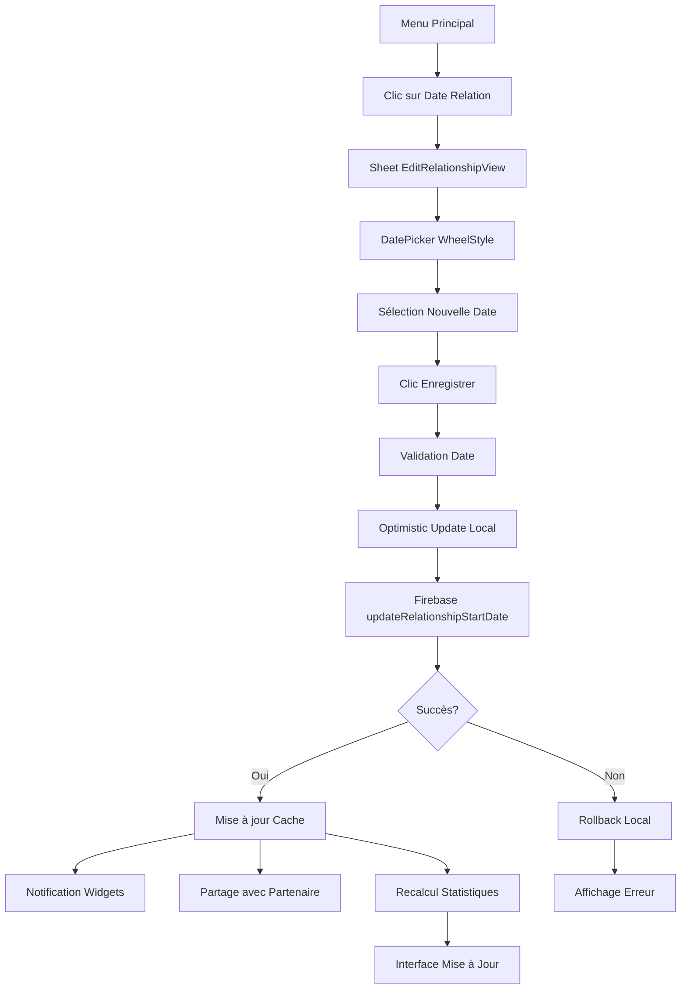

# Rapport Technique : Changement de Date de Couple - CoupleApp

## 📋 Vue d'Ensemble

Ce document détaille le processus complet de modification de la date de début de relation de couple dans l'application CoupleApp, incluant le carrousel multilingue, les clés de localisation, l'interface utilisateur, l'intégration Firebase et la transposition pour Android.

## 🎯 Architecture du Système

### 1. Points d'Accès au Changement de Date

#### 1.1 Depuis le Menu Principal

**Fichier:** `Views/Main/MenuView.swift`

```swift
// Ligne d'informations de relation dans le profil
HStack {
    Text("relationship_start".localized)
        .font(.system(size: 16))
        .foregroundColor(.black.opacity(0.8))

    Spacer()

    Button(action: {
        showingRelationshipEdit = true
    }) {
        Text(formattedRelationshipDate)
            .font(.system(size: 16, weight: .medium))
            .foregroundColor(Color(hex: "#FD267A"))
            .underline()
    }
}

// Sheet modal pour modification
.sheet(isPresented: $showingRelationshipEdit) {
    NavigationView {
        EditRelationshipView(
            currentDate: formattedRelationshipDate,
            onSave: updateRelationshipStart
        )
        .navigationTitle("edit_relationship_start".localized)
        .navigationBarTitleDisplayMode(.inline)
        .navigationBarBackButtonHidden(true)
        .toolbar {
            ToolbarItem(placement: .navigationBarLeading) {
                Button("cancel".localized) {
                    showingRelationshipEdit = false
                }
            }
        }
    }
}
```

### 2. Interface de Modification - EditRelationshipView

#### 2.1 Structure du Composant

```swift
struct EditRelationshipView: View {
    let currentDate: String
    let onSave: (String) -> Void
    @Environment(\.dismiss) private var dismiss
    @State private var selectedDate = Date()

    init(currentDate: String, onSave: @escaping (String) -> Void) {
        self.currentDate = currentDate
        self.onSave = onSave

        // ✅ Initialiser avec la date actuelle
        let formatter = DateFormatter()
        formatter.dateStyle = .long
        formatter.locale = Locale.current
        if let date = formatter.date(from: currentDate) {
            self._selectedDate = State(initialValue: date)
        } else {
            self._selectedDate = State(initialValue: Date())
        }
    }
}
```

#### 2.2 Carrousel de Date (WheelDatePickerStyle)

```swift
var body: some View {
    VStack(spacing: 20) {
        // 🎡 CARROUSEL DE DATE
        DatePicker(
            "",
            selection: $selectedDate,
            displayedComponents: .date
        )
        .datePickerStyle(WheelDatePickerStyle())  // Style carrousel natif iOS
        .labelsHidden()
        .environment(\.locale, Locale.current)   // 🌍 Localisation automatique

        // 💾 BOUTON ENREGISTRER
        Button(action: {
            let formatter = DateFormatter()
            formatter.dateStyle = .long
            formatter.locale = Locale.current
            onSave(formatter.string(from: selectedDate))
            dismiss()
        }) {
            Text("save".localized)
                .font(.system(size: 16, weight: .semibold))
                .foregroundColor(.white)
                .frame(maxWidth: .infinity)
                .padding(.vertical, 14)
                .background(
                    LinearGradient(
                        gradient: Gradient(colors: [
                            Color(hex: "#FD267A"),  // Rose principal
                            Color(hex: "#FF655B")   // Orange dégradé
                        ]),
                        startPoint: .leading,
                        endPoint: .trailing
                    )
                )
                .cornerRadius(25)
        }
    }
    .padding(24)
    .background(Color.white)
}
```

## 🎨 Design et Interface Utilisateur

### 3. Spécifications Visuelles

#### 3.1 Carrousel de Date

- **Type:** `WheelDatePickerStyle()` - Carrousel natif iOS
- **Couleurs:** Texte noir sur fond transparent
- **Localisation:** Automatique via `Locale.current`
- **Hauteur:** Hauteur automatique (~200px typiquement)

#### 3.2 Bouton d'Enregistrement

```swift
// Design avec dégradé rose-orange
LinearGradient(
    gradient: Gradient(colors: [
        Color(hex: "#FD267A"),  // Rose principal de l'app
        Color(hex: "#FF655B")   // Orange pour le dégradé
    ]),
    startPoint: .leading,
    endPoint: .trailing
)
.cornerRadius(25)           // Coins très arrondis
.frame(maxWidth: .infinity) // Pleine largeur
.padding(.vertical, 14)     // Hauteur confortable
```

#### 3.3 Conteneur Principal

```swift
VStack(spacing: 20)         // Espacement vertical 20px
    .padding(24)            // Marges intérieures 24px
    .background(Color.white) // Fond blanc pur
```

## 🌍 Système Multilingue

### 4. Architecture de Localisation

#### 4.1 Fichiers de Localisation

- **Fichier principal:** `UI.xcstrings`
- **Langues supportées:** EN (source), FR, ES, IT, NL, PT, PT-BR
- **Format:** String Catalog iOS (.xcstrings)

#### 4.2 Clés Multilingues des Mois

**Fichier:** `UI.xcstrings`

```json
"month_january" : {
    "localizations" : {
        "en" : { "stringUnit" : { "value" : "January" }},
        "es" : { "stringUnit" : { "value" : "Enero" }},
        "fr" : { "stringUnit" : { "value" : "Janvier" }},
        "it" : { "stringUnit" : { "value" : "Gennaio" }},
        "nl" : { "stringUnit" : { "value" : "Januari" }},
        "pt" : { "stringUnit" : { "value" : "Janeiro" }}
    }
}
// ... pour tous les mois (12 clés au total)
```

**Liste complète des clés mois:**

- `month_january` → Janvier / January / Enero...
- `month_february` → Février / February / Febrero...
- `month_march` → Mars / March / Marzo...
- `month_april` → Avril / April / Abril...
- `month_may` → Mai / May / Mayo...
- `month_june` → Juin / June / Junio...
- `month_july` → Juillet / July / Julio...
- `month_august` → Août / August / Agosto...
- `month_september` → Septembre / September / Septiembre...
- `month_october` → Octobre / October / Octubre...
- `month_november` → Novembre / November / Noviembre...
- `month_december` → Décembre / December / Diciembre...

#### 4.3 Autres Clés Interface

**Fichier:** `Localizable.xcstrings` et `UI.xcstrings`

```json
"save" : {
    "localizations" : {
        "en" : { "stringUnit" : { "value" : "Save" }},
        "fr" : { "stringUnit" : { "value" : "Enregistrer" }},
        "es" : { "stringUnit" : { "value" : "Guardar" }},
        "it" : { "stringUnit" : { "value" : "Salva" }}
    }
}

"cancel" : {
    "localizations" : {
        "en" : { "stringUnit" : { "value" : "Cancel" }},
        "fr" : { "stringUnit" : { "value" : "Annuler" }},
        "es" : { "stringUnit" : { "value" : "Cancelar" }},
        "it" : { "stringUnit" : { "value" : "Annulla" }}
    }
}

"relationship_start" : {
    "localizations" : {
        "en" : { "stringUnit" : { "value" : "Together since" }},
        "fr" : { "stringUnit" : { "value" : "Ensemble depuis" }},
        "es" : { "stringUnit" : { "value" : "Juntos desde" }},
        "it" : { "stringUnit" : { "value" : "Insieme dal" }}
    }
}
```

### 5. Usage des Clés dans le Code

#### 5.1 Extension String pour Localisation

```swift
extension String {
    var localized: String {
        return NSLocalizedString(self, comment: "")
    }
}
```

#### 5.2 Utilisation dans les Vues

```swift
// Texte localisé automatique
Text("save".localized)
Text("relationship_start".localized)

// DateFormatter avec locale
let formatter = DateFormatter()
formatter.dateStyle = .long
formatter.locale = Locale.current  // 🌍 Localisation auto
```

## 🔥 Intégration Firebase

### 6. Service Firebase - updateRelationshipStartDate

**Fichier:** `Services/FirebaseService.swift`

```swift
func updateRelationshipStartDate(_ date: Date, completion: @escaping (Bool) -> Void) {
    guard let firebaseUser = Auth.auth().currentUser else {
        print("❌ FirebaseService: Aucun utilisateur connecté pour mise à jour date relation")
        completion(false)
        return
    }

    print("🔥 FirebaseService: Mise à jour date début relation: \(date)")

    // 📡 Mise à jour Firestore
    db.collection("users").document(firebaseUser.uid).updateData([
        "relationshipStartDate": Timestamp(date: date),
        "updatedAt": Timestamp(date: Date())
    ]) { [weak self] error in
        DispatchQueue.main.async {
            if let error = error {
                print("❌ FirebaseService: Erreur mise à jour date relation: \(error.localizedDescription)")
                completion(false)
            } else {
                print("✅ FirebaseService: Date relation mise à jour avec succès")

                // 💾 Mise à jour utilisateur local
                if var currentUser = self?.currentUser {
                    currentUser.relationshipStartDate = date
                    self?.currentUser = currentUser

                    // 🚀 Mise à jour cache immédiate
                    UserCacheManager.shared.cacheUser(currentUser)
                    print("💾 FirebaseService: Cache utilisateur mis à jour avec nouvelle date relation")
                }
                completion(true)
            }
        }
    }
}
```

### 7. Processus Complet de Mise à Jour

#### 7.1 Chaîne d'Exécution

```swift
// 1. MenuView - Action utilisateur
private func updateRelationshipStart(_ newDateString: String) {
    // Convertir string → Date
    let formatter = DateFormatter()
    formatter.dateStyle = .long
    formatter.locale = Locale.current

    guard let date = formatter.date(from: newDateString) else { return }

    // 2. Mise à jour locale immédiate (optimistic update)
    if var currentUser = appState.currentUser {
        currentUser.relationshipStartDate = date
        appState.currentUser = currentUser
    }

    // 3. Sauvegarde Firebase
    FirebaseService.shared.updateRelationshipStartDate(date) { success in
        DispatchQueue.main.async {
            if !success {
                // 4. Rollback en cas d'erreur
                if let originalUser = self.appState.currentUser {
                    var rollbackUser = originalUser
                    rollbackUser.relationshipStartDate = nil // ou valeur précédente
                    self.appState.currentUser = rollbackUser
                }
            }
        }
    }
}
```

### 8. Structure de Données Firebase

#### 8.1 Document Utilisateur

```json
{
  "users/{userId}": {
    "id": "string",
    "name": "string",
    "relationshipStartDate": "Timestamp", // 🎯 Champ mis à jour
    "partnerId": "string",
    "updatedAt": "Timestamp"
    // ... autres champs
  }
}
```

#### 8.2 Partage avec Partenaire

```swift
// Mise à jour automatique des données partagées
func updateSharedPartnerData() {
    let sharedData: [String: Any] = [
        "name": currentUser.name,
        "relationshipStartDate": currentUser.relationshipStartDate != nil ?
            Timestamp(date: currentUser.relationshipStartDate!) : NSNull(),
        "lastActive": Timestamp(date: Date()),
        // ...
    ]

    db.collection("sharedPartnerData").document(firebaseUser.uid)
        .setData(sharedData, merge: true)
}
```

## 📊 Impact sur les Widgets et Statistiques

### 9. Mise à Jour Automatique des Widgets

**Fichier:** `Services/WidgetService.swift`

```swift
private func updateRelationshipStats() {
    guard let user = currentUser,
          let startDate = user.relationshipStartDate else {
        relationshipStats = nil
        return
    }

    let calendar = Calendar.current
    let now = Date()

    // 📊 Calculs automatiques basés sur la nouvelle date
    let dayComponents = calendar.dateComponents([.day], from: startDate, to: now)
    let daysTogether = max(dayComponents.day ?? 0, 0)

    // Années, mois, jours
    let components = calendar.dateComponents([.year, .month, .day], from: startDate, to: now)
    let years = components.year ?? 0
    let months = components.month ?? 0
    let days = components.day ?? 0

    // Prochain anniversaire
    var nextAnniversary = calendar.dateComponents([.month, .day], from: startDate)
    nextAnniversary.year = calendar.component(.year, from: now)

    if let nextAnniversaryDate = calendar.date(from: nextAnniversary),
       nextAnniversaryDate < now {
        nextAnniversary.year = (nextAnniversary.year ?? 0) + 1
    }

    // 📱 Mise à jour widgets iOS
    relationshipStats = RelationshipStats(
        daysTogether: daysTogether,
        years: years,
        months: months,
        days: days,
        nextAnniversary: nextAnniversaryDate,
        timeToAnniversary: timeToAnniversary
    )

    saveWidgetData() // Persist pour widgets
}
```

## 🤖 Guide d'Implémentation Android

### 10. Architecture Android Recommandée

#### 10.1 Structure des Composants

```kotlin
// MainActivity ou SettingsActivity
class RelationshipDateActivity : ComponentActivity() {
    private lateinit var viewModel: RelationshipViewModel
    private lateinit var firebaseService: FirebaseService

    override fun onCreate(savedInstanceState: Bundle?) {
        super.onCreate(savedInstanceState)

        setContent {
            RelationshipDateScreen(
                viewModel = viewModel,
                onDateSaved = { date ->
                    viewModel.updateRelationshipDate(date)
                }
            )
        }
    }
}
```

#### 10.2 Interface Compose avec DatePicker

```kotlin
@OptIn(ExperimentalMaterial3Api::class)
@Composable
fun RelationshipDateScreen(
    viewModel: RelationshipViewModel,
    onDateSaved: (LocalDate) -> Unit
) {
    var selectedDate by remember { mutableStateOf(LocalDate.now()) }
    var showDatePicker by remember { mutableStateOf(false) }
    val datePickerState = rememberDatePickerState()

    Column(
        modifier = Modifier
            .fillMaxSize()
            .padding(24.dp),
        verticalArrangement = Arrangement.SpaceBetween
    ) {
        // 🎡 CARROUSEL DE DATE ANDROID
        Card(
            modifier = Modifier.fillMaxWidth(),
            colors = CardDefaults.cardColors(containerColor = Color.White)
        ) {
            DatePicker(
                state = datePickerState,
                modifier = Modifier.padding(16.dp),
                title = null,
                headline = null,
                showModeToggle = false
            )
        }

        // 💾 BOUTON ENREGISTRER
        Button(
            onClick = {
                datePickerState.selectedDateMillis?.let { millis ->
                    val date = Instant.ofEpochMilli(millis)
                        .atZone(ZoneId.systemDefault())
                        .toLocalDate()
                    onDateSaved(date)
                }
            },
            modifier = Modifier
                .fillMaxWidth()
                .height(56.dp),
            colors = ButtonDefaults.buttonColors(
                containerColor = Color(0xFFFF267A) // Rose de l'app
            ),
            shape = RoundedCornerShape(25.dp)
        ) {
            Text(
                text = stringResource(R.string.save), // 🌍 Localisation
                fontSize = 16.sp,
                fontWeight = FontWeight.SemiBold,
                color = Color.White
            )
        }
    }
}
```

### 11. Système de Localisation Android

#### 11.1 Fichiers de Ressources Multilingues

```xml
<!-- res/values/strings.xml (EN - défaut) -->
<resources>
    <string name="save">Save</string>
    <string name="cancel">Cancel</string>
    <string name="relationship_start">Together since</string>

    <!-- Mois -->
    <string name="month_january">January</string>
    <string name="month_february">February</string>
    <string name="month_march">March</string>
    <!-- ... tous les mois -->
</resources>

<!-- res/values-fr/strings.xml -->
<resources>
    <string name="save">Enregistrer</string>
    <string name="cancel">Annuler</string>
    <string name="relationship_start">Ensemble depuis</string>

    <!-- Mois -->
    <string name="month_january">Janvier</string>
    <string name="month_february">Février</string>
    <string name="month_march">Mars</string>
    <!-- ... tous les mois -->
</resources>

<!-- res/values-es/strings.xml -->
<resources>
    <string name="save">Guardar</string>
    <string name="cancel">Cancelar</string>
    <string name="relationship_start">Juntos desde</string>

    <!-- Mois -->
    <string name="month_january">Enero</string>
    <string name="month_february">Febrero</string>
    <string name="month_march">Marzo</string>
    <!-- ... todos los meses -->
</resources>
```

#### 11.2 Formatage des Dates Localisé

```kotlin
class DateFormatter {
    companion object {
        fun formatLongDate(date: LocalDate, locale: Locale = Locale.getDefault()): String {
            val formatter = DateTimeFormatter.ofLocalizedDate(FormatStyle.LONG)
                .withLocale(locale)
            return date.format(formatter)
        }

        fun getMonthName(month: Int, context: Context): String {
            val monthResources = arrayOf(
                R.string.month_january,
                R.string.month_february,
                R.string.month_march,
                R.string.month_april,
                R.string.month_may,
                R.string.month_june,
                R.string.month_july,
                R.string.month_august,
                R.string.month_september,
                R.string.month_october,
                R.string.month_november,
                R.string.month_december
            )

            return if (month in 1..12) {
                context.getString(monthResources[month - 1])
            } else {
                ""
            }
        }
    }
}
```

### 12. Intégration Firebase Android

#### 12.1 Service Firebase Kotlin

```kotlin
class FirebaseService {
    private val db = FirebaseFirestore.getInstance()
    private val auth = FirebaseAuth.getInstance()

    suspend fun updateRelationshipStartDate(date: LocalDate): Result<Unit> {
        return try {
            val currentUser = auth.currentUser
                ?: return Result.failure(Exception("Utilisateur non connecté"))

            val timestamp = Timestamp(date.atStartOfDay(ZoneId.systemDefault()).toInstant())

            // 📡 Mise à jour Firestore
            db.collection("users")
                .document(currentUser.uid)
                .update(
                    mapOf(
                        "relationshipStartDate" to timestamp,
                        "updatedAt" to Timestamp.now()
                    )
                )
                .await()

            // 💾 Mise à jour cache local
            updateUserCache(date)

            // 📊 Notification widgets
            notifyWidgetsUpdate()

            Result.success(Unit)
        } catch (e: Exception) {
            Result.failure(e)
        }
    }

    private fun updateUserCache(date: LocalDate) {
        // Mise à jour SharedPreferences ou Room Database
        val prefs = context.getSharedPreferences("user_cache", Context.MODE_PRIVATE)
        prefs.edit()
            .putLong("relationship_start_date", date.toEpochDay())
            .apply()
    }

    private fun notifyWidgetsUpdate() {
        // Notification des widgets Android
        val appWidgetManager = AppWidgetManager.getInstance(context)
        val provider = ComponentName(context, CoupleWidgetProvider::class.java)
        val ids = appWidgetManager.getAppWidgetIds(provider)

        val intent = Intent(context, CoupleWidgetProvider::class.java)
        intent.action = AppWidgetManager.ACTION_APPWIDGET_UPDATE
        intent.putExtra(AppWidgetManager.EXTRA_APPWIDGET_IDS, ids)
        context.sendBroadcast(intent)
    }
}
```

#### 12.2 ViewModel avec État

```kotlin
class RelationshipViewModel(
    private val firebaseService: FirebaseService
) : ViewModel() {

    private val _uiState = MutableLiveData<UiState>()
    val uiState: LiveData<UiState> = _uiState

    data class UiState(
        val currentDate: LocalDate? = null,
        val isLoading: Boolean = false,
        val error: String? = null
    )

    fun updateRelationshipDate(date: LocalDate) {
        _uiState.value = _uiState.value?.copy(isLoading = true)

        viewModelScope.launch {
            firebaseService.updateRelationshipStartDate(date)
                .onSuccess {
                    _uiState.value = UiState(
                        currentDate = date,
                        isLoading = false,
                        error = null
                    )
                }
                .onFailure { exception ->
                    _uiState.value = _uiState.value?.copy(
                        isLoading = false,
                        error = exception.message
                    )
                }
        }
    }
}
```

### 13. Design System Android

#### 13.1 Couleurs et Thème

```kotlin
// res/values/colors.xml
<resources>
    <color name="primary_pink">#FD267A</color>
    <color name="secondary_orange">#FF655B</color>
    <color name="background_white">#FFFFFF</color>
    <color name="text_primary">#000000</color>
    <color name="text_secondary">#80000000</color>
</resources>

// Theme.kt
val CoupleAppTheme = lightColorScheme(
    primary = Color(0xFFFF267A),
    secondary = Color(0xFFFF655B),
    background = Color(0xFFFFFFFF),
    surface = Color(0xFFFFFFFF),
    onPrimary = Color.White,
    onBackground = Color.Black
)
```

#### 13.2 Composants Réutilisables

```kotlin
@Composable
fun GradientButton(
    text: String,
    onClick: () -> Unit,
    modifier: Modifier = Modifier,
    enabled: Boolean = true
) {
    Button(
        onClick = onClick,
        modifier = modifier,
        enabled = enabled,
        colors = ButtonDefaults.buttonColors(
            containerColor = Color.Transparent
        ),
        contentPadding = PaddingValues(),
        shape = RoundedCornerShape(25.dp)
    ) {
        Box(
            modifier = Modifier
                .background(
                    brush = Brush.horizontalGradient(
                        colors = listOf(
                            Color(0xFFFF267A), // Rose principal
                            Color(0xFFFF655B)  // Orange dégradé
                        )
                    ),
                    shape = RoundedCornerShape(25.dp)
                )
                .fillMaxWidth()
                .padding(vertical = 14.dp),
            contentAlignment = Alignment.Center
        ) {
            Text(
                text = text,
                fontSize = 16.sp,
                fontWeight = FontWeight.SemiBold,
                color = Color.White
            )
        }
    }
}
```

## 🎯 Checklist d'Implémentation Android

### 14. Étapes Recommandées

#### ✅ **Interface Utilisateur**

- [ ] Créer `RelationshipDateActivity` avec Compose
- [ ] Implémenter `DatePicker` Material3 avec carrousel
- [ ] Configurer bouton gradient rose-orange
- [ ] Ajouter animations et transitions fluides
- [ ] Tester responsive sur différentes tailles d'écran

#### ✅ **Localisation**

- [ ] Créer fichiers `strings.xml` pour toutes les langues (EN, FR, ES, IT, NL, PT)
- [ ] Traduire toutes les clés interface : save, cancel, months, etc.
- [ ] Implémenter `DateFormatter` localisé
- [ ] Tester changement de langue dynamique
- [ ] Vérifier RTL pour langues supportées futures

#### ✅ **Firebase Integration**

- [ ] Créer `FirebaseService.updateRelationshipStartDate()`
- [ ] Implémenter cache local avec SharedPreferences
- [ ] Ajouter gestion d'erreurs robuste
- [ ] Configurer rollback en cas d'échec réseau
- [ ] Tester synchronisation offline/online

#### ✅ **État et Navigation**

- [ ] Créer `RelationshipViewModel` avec LiveData
- [ ] Gérer états loading/success/error
- [ ] Implémenter navigation retour avec résultat
- [ ] Ajouter validation de dates (pas dans le futur)
- [ ] Sauvegarder état lors rotation écran

#### ✅ **Widgets et Statistiques**

- [ ] Mettre à jour widgets couple après changement date
- [ ] Recalculer statistiques automatiquement
- [ ] Partager nouvelle date avec partenaire
- [ ] Synchroniser avec données partagées
- [ ] Tester impact sur toutes les features dépendantes

#### ✅ **Tests et Qualité**

- [ ] Tests unitaires ViewModel et Firebase Service
- [ ] Tests UI avec Compose Testing
- [ ] Tests de localisation sur toutes les langues
- [ ] Tests de performance sur dates extrêmes
- [ ] Tests d'intégration bout en bout

## 📊 Diagramme de Flux Complet



---

**Date de génération :** September 26, 2025  
**Version CoupleApp :** iOS Current  
**Destiné pour :** Implémentation Android  
**Langues supportées :** EN, FR, ES, IT, NL, PT, PT-BR  
**Complexité :** Modérée - Interface + Firebase + Localisation
