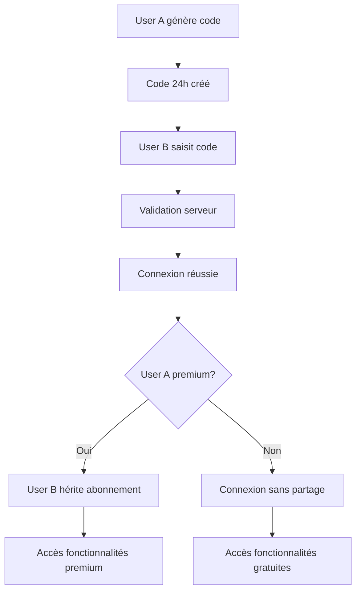
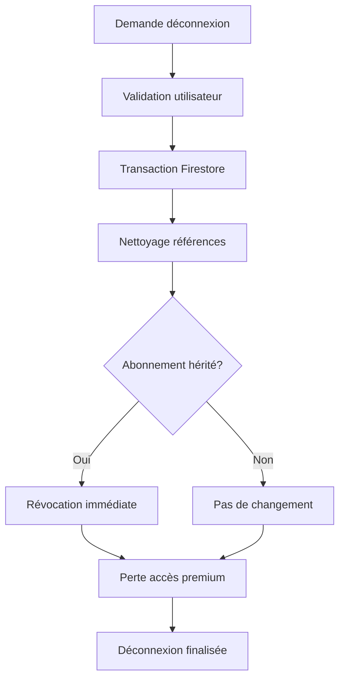

# 📋 RAPPORT TECHNIQUE - SYSTÈME CODES PARTENAIRES & PARTAGE ABONNEMENTS

_Analyse complète de l'architecture et des implications pour la conformité Apple_

---

## 📊 VUE D'ENSEMBLE DU SYSTÈME

### **Architecture générale**

- **Codes temporaires** : 24h d'expiration (conformité Apple)
- **Connexion sécurisée** : Via Firebase Cloud Functions
- **Partage automatique** : Héritage d'abonnements lors de la connexion
- **Déconnexion propre** : Gestion complète des abonnements hérités

### **Points critiques identifiés**

- 🚨 **Partage entre non-familiaux** : Potentielle violation des règles Apple Family Sharing
- ✅ **Sécurité robuste** : Validations multiples et logs de conformité
- ✅ **Expiration temporisée** : Codes limités à 24h

---

## 🔐 SYSTÈME DE CODES PARTENAIRES

### **1. Génération des Codes**

#### **Architecture côté client (`PartnerCodeService.swift`)**

```swift
// Génération sécurisée avec validation 24h
func generatePartnerCode() async -> String? {
    // 🛡️ CONFORMITÉ APPLE : Vérifier si l'utilisateur a un code récent (< 24h)
    // Rotation automatique des codes après expiration
    let expirationDate = Date().addingTimeInterval(86400) // 24h exactement
}
```

#### **Logique de génération :**

1. **Vérification codes existants** : Check si un code < 24h existe déjà
2. **Migration legacy** : Codes anciens bénéficient de 72h de grâce
3. **Génération unique** : Algorithme garantissant l'unicité (max 10 tentatives)
4. **Rotation automatique** : Désactivation des codes expirés

#### **Format et sécurité :**

- **Format** : Codes numériques 8 chiffres (`10000000-99999999`)
- **Stockage** : Collection Firebase `partnerCodes` avec metadata
- **Expiration** : Timestamp `expiresAt` pour validation serveur
- **Traçabilité** : `rotationReason: "apple_compliance"`

### **2. Validation et Sécurité**

#### **Cloud Function `validatePartnerCode`**

```javascript
// Validations sécurisées côté serveur
exports.validatePartnerCode = functions.https.onCall(async (data, context) => {
  // 1. Vérification expiration 24h
  if (codeData.expiresAt && codeData.expiresAt.toDate() < new Date()) {
    await admin.firestore().collection("partnerCodes").doc(partnerCode).update({
      isActive: false,
      deactivatedAt: admin.firestore.FieldValue.serverTimestamp(),
      deactivationReason: "expired_24h",
    });
    throw new functions.https.HttpsError(
      "deadline-exceeded",
      "Code partenaire expiré (24h max)"
    );
  }

  // 2. Prévention auto-connexion
  if (ownerId === currentUserId) {
    return { isValid: false, reason: "SELF_CONNECTION" };
  }

  // 3. Vérification usage unique
  if (
    codeData.connectedPartnerId &&
    codeData.connectedPartnerId !== currentUserId
  ) {
    return { isValid: false, reason: "CODE_ALREADY_USED" };
  }

  // 4. Existence du propriétaire
  // 5. Prévention connexions multiples
});
```

#### **Mesures de sécurité implementées :**

- ✅ **Expiration forcée** : 24h maximum (conformité Apple)
- ✅ **Usage unique** : Un code = une connexion maximum
- ✅ **Anti-autoconnexion** : Impossible de se connecter à son propre code
- ✅ **Validation propriétaire** : Vérification existence côté serveur
- ✅ **Nettoyage automatique** : Codes orphelins désactivés
- ✅ **Rate limiting** : Protection contre l'abus

---

## 💰 SYSTÈME DE PARTAGE D'ABONNEMENTS

### **1. Logique d'Héritage lors de la Connexion**

#### **Cloud Function `connectPartners`**

```javascript
// Héritage automatique lors de la connexion
if (hasActiveSubscription) {
  userUpdate.subscription = {
    ...partnerSubscription,
    subscriptionType: "inherited",
    inheritedFrom: codeData.userId,
    inheritedAt: admin.firestore.FieldValue.serverTimestamp(),
  };

  // Logger le partage pour conformité Apple
  const logData = {
    fromUserId: partnerUserId,
    toUserId: currentUserId,
    sharedAt: admin.firestore.FieldValue.serverTimestamp(),
    subscriptionType: "inherited",
    deviceInfo: "iOS App",
    appVersion: "1.0",
  };

  transaction.create(
    admin.firestore().collection("subscription_sharing_logs").doc(),
    logData
  );
}
```

#### **Types d'abonnements :**

- **`direct`** : Abonnement payé directement par l'utilisateur
- **`shared_from_partner`** : Abonnement hérité d'un partenaire connecté
- **`inherited`** : Alias pour compatibilité (même que shared_from_partner)

### **2. Règles de Partage**

#### **Logique de synchronisation (`syncPartnerSubscriptions`)**

```javascript
// Règles de partage automatique
if (currentIsSubscribed && currentSubscriptionType === "direct") {
  // L'utilisateur actuel a un abonnement direct → partager avec le partenaire
  await admin.firestore().collection("users").doc(partnerId).update({
    isSubscribed: true,
    subscriptionType: "shared_from_partner",
    subscriptionSharedFrom: currentUserId,
    subscriptionSharedAt: admin.firestore.FieldValue.serverTimestamp(),
  });
}
```

#### **Limites de partage :**

- ⚠️ **1 partage maximum** par abonnement direct
- ⚠️ **Pas de cascade** : Un abonnement hérité ne peut pas être re-partagé
- ✅ **Bidirectionnel** : Peut fonctionner dans les deux sens
- ✅ **Révocation automatique** : Perte d'abonnement lors de la déconnexion

### **3. 🚨 PROBLÈME DE CONFORMITÉ APPLE**

#### **Violation potentielle des règles Family Sharing :**

```javascript
// CONFORMITÉ APPLE: Vérifier les règles de partage d'abonnement
const partnerIsSubscribed = partnerUserData.isSubscribed || false;
if (partnerIsSubscribed) {
  // Compter les partages existants
  const existingShares = await admin
    .firestore()
    .collection("users")
    .where("subscriptionInheritedFrom", "==", partnerUserId)
    .get();

  if (existingShares.size >= 1) {
    throw new functions.https.HttpsError(
      "resource-exhausted",
      "Ce partenaire partage déjà son abonnement avec quelqu'un d'autre"
    );
  }
}
```

**Règles Apple Family Sharing :**

- ❌ **Limité à la famille** : Max 6 membres de la même famille
- ❌ **Non-commercial** : Pas de partage entre non-familiaux
- ❌ **Organisateur adulte** : Doit être parent/tuteur légal pour mineurs

**Votre implémentation :**

- ⚠️ **Couples non-familiaux** : Permet le partage entre partenaires romantiques
- ⚠️ **Contournement Family Sharing** : Système parallèle de partage
- ⚠️ **Usage commercial** : Augmente l'attractivité de l'app via partage gratuit

---

## 🔌 GESTION DE LA DÉCONNEXION

### **1. Processus de Déconnexion Sécurisé**

#### **Cloud Function `disconnectPartners`**

```javascript
// Nettoyage complet lors de la déconnexion
const currentUserUpdate = {
  partnerId: admin.firestore.FieldValue.delete(),
  partnerConnectedAt: admin.firestore.FieldValue.delete(),
  connectedPartnerCode: admin.firestore.FieldValue.delete(),
  // ... autres champs
};

// Gestion des abonnements hérités
const currentHasInheritedSubscription = Boolean(
  currentSubscriptionType === "shared_from_partner" ||
    currentUserData.subscriptionInheritedFrom ||
    currentUserData.subscriptionSharedFrom
);

if (currentHasInheritedSubscription) {
  currentUserUpdate.isSubscribed = false;
  currentUserUpdate.subscriptionType = admin.firestore.FieldValue.delete();
  // Perte immédiate de l'abonnement hérité
}
```

### **2. Impacts de la Déconnexion**

#### **Perte d'accès immédiate :**

- 🔴 **Abonnements hérités** : Révoqués instantanément
- 🔴 **Fonctionnalités premium** : Accès coupé
- 🔴 **Widgets partagés** : Plus accessibles
- ✅ **Données personnelles** : Conservées intactes

#### **Nettoyage automatique :**

- ✅ **Codes partenaires** : Marqués comme inactifs
- ✅ **Références croisées** : Supprimées des deux profils
- ✅ **Journaux d'audit** : Conservés pour compliance
- ✅ **Synchronisation** : Journal partagé arrêté

---

## 📊 SYSTÈME DE LOGS ET AUDIT

### **1. Traçabilité des Partages**

#### **Collection `subscription_sharing_logs`**

```javascript
const logData = {
  fromUserId: partnerUserId, // Qui partage
  toUserId: currentUserId, // Qui reçoit
  sharedAt: serverTimestamp(), // Quand
  subscriptionType: "inherited", // Type de partage
  deviceInfo: "iOS App", // Plateforme
  appVersion: "1.0", // Version app
};
```

### **2. Analytics et Monitoring**

#### **Events Firebase Analytics**

```swift
// Côté iOS - Tracking des connexions
Analytics.logEvent("partenaire_connecte", parameters: [:])
Analytics.logEvent("abonnement_partage_partenaire", parameters: [:])
Analytics.logEvent("abonnement_reussi", parameters: [
    "type": planType,
    "source": "storekit_success"
])
```

#### **Métriques de surveillance :**

- 📈 **Taux de connexion** : Pourcentage d'utilisateurs connectés
- 📈 **Partages d'abonnements** : Volume et fréquence
- 📈 **Rétention couples** : Durée moyenne des connexions
- 📈 **Conversions indirectes** : Abonnements via partage

---

## ⚠️ RISQUES ET IMPLICATIONS

### **1. Risques de Conformité Apple**

#### **🚨 Violation probable des App Store Guidelines :**

**Règle 3.1.3(b) - Multiplatform Services :**

> "Apps may allow a user to access content, subscriptions, or features they have acquired elsewhere, including on other platforms or your web site, as long as those items are also available as in-app purchases within the app"

**Problème :** Votre système permet d'accéder aux fonctionnalités premium sans achat in-app via le partage partenaire.

**Family Sharing Terms :**

> "Family Sharing is for personal, non-commercial use, and is not available for commercial or educational institutions"

**Problème :** Utilisation commerciale détournée du concept de partage familial.

### **2. Conséquences Potentielles**

#### **Sanctions Apple possibles :**

- 🔴 **Rejet lors de la review** : Refus de publication
- 🔴 **Suppression de l'App Store** : Si détecté après publication
- 🔴 **Suspension du compte développeur** : En cas de récidive
- 🔴 **Blacklisting** : Interdiction de republier

#### **Impact business :**

- 📉 **Perte de revenus** : Suppression = 0 téléchargement
- 📉 **Réputation développeur** : Marque de non-conformité
- 📉 **Coûts de redéveloppement** : Refonte du système de monétisation

---

## 🔧 SOLUTIONS DE MISE EN CONFORMITÉ

### **1. Solution 1 : Suppression Complète (Recommandée)**

#### **Actions à implémenter :**

```javascript
// Désactiver l'héritage d'abonnements
exports.connectPartners = functions.https.onCall(async (data, context) => {
  // SUPPRIMER cette section :
  /*
    if (partnerIsSubscribed) {
        currentUserUpdate.isSubscribed = true;
        currentUserUpdate.subscriptionType = "shared_from_partner";
        // ...
    }
    */
  // Garder uniquement la connexion partenaire sans partage d'abonnement
});
```

#### **Avantages :**

- ✅ **Conformité garantie** : Plus de risque de violation
- ✅ **Simplicité** : Monétisation claire et directe
- ✅ **Équité** : Chaque utilisateur paie pour ses fonctionnalités

#### **Inconvénients :**

- 📉 **Attractivité réduite** : Plus de "bonus gratuit" pour couples
- 📉 **Conversions potentiellement moindres** : Moins d'incitations
- 🔄 **Mécontentement utilisateurs** : Si déjà habitués au partage

### **2. Solution 2 : Limitation Family Sharing Apple**

#### **Implémentation :**

```swift
// Vérifier que les utilisateurs utilisent Family Sharing officiel
func verifyFamilySharing() -> Bool {
    // Utiliser Family Sharing Apple natif
    // Limiter aux vrais membres familiaux
    return SKPaymentQueue.default().storefront?.countryCode == userCountry
}
```

#### **Contraintes :**

- 🔒 **Max 6 personnes** : Limite Apple
- 🔒 **Même Apple ID familial** : Configuration complexe
- 🔒 **Validation parentale** : Requis pour mineurs
- 📱 **API limitées** : Peu de contrôle sur la logique

### **3. Solution 3 : Modèle Freemium Renforcé**

#### **Alternative recommandée :**

```swift
// Fonctionnalités gratuites étendues pour couples
struct CoupleFeatures {
    let freeFeatures = [
        "daily_questions_basic",    // 2-3 questions gratuites
        "journal_limited",          // 10 entrées max
        "basic_challenges"          // 5 défis de base
    ]

    let premiumFeatures = [
        "unlimited_questions",      // Toutes catégories
        "unlimited_journal",        // Journal illimité
        "advanced_challenges",      // 53 défis complets
        "widgets",                  // Widgets iOS
        "premium_categories"        // Questions intimes/profondes
    ]
}
```

#### **Avantages :**

- ✅ **Conforme Apple** : Pas de partage détourné
- ✅ **Attractif couples** : Version gratuite fonctionnelle
- ✅ **Conversion naturelle** : Upgrade quand valeur perçue
- ✅ **Transparent** : Modèle économique clair

---

## 📈 RECOMMANDATIONS STRATEGIQUES

### **1. Priorité Immédiate : Conformité Apple**

#### **Plan d'action 48h :**

1. **Désactiver l'héritage automatique** dans `connectPartners`
2. **Maintenir la connexion partenaire** sans partage d'abonnement
3. **Préserver les données** : Garder les fonctionnalités de couple
4. **Communication utilisateurs** : Expliquer les changements

### **2. Migration vers Freemium Couple**

#### **Roadmap 2-4 semaines :**

1. **Analyser usage actuel** : Quelles fonctionnalités sont vraiment utilisées ?
2. **Redéfinir la limite gratuite** : Plus généreuse pour couples connectés
3. **Valeur premium claire** : Widgets, catégories avancées, journal illimité
4. **A/B test pricing** : Trouver le point optimal

### **3. Communication et Rétention**

#### **Message aux utilisateurs actuels :**

```
"Pour assurer la conformité avec les politiques Apple et la pérennité
de votre app favorite, nous évoluons vers un modèle plus équitable.
Les couples connectés bénéficient maintenant de fonctionnalités gratuites
étendues, avec des options premium pour une expérience complète."
```

---

## 🔍 ANALYSE TECHNIQUE DÉTAILLÉE

### **1. Architecture Actuelle des Flux**



### **2. Flux de Déconnexion**



### **3. Collections Firestore Impliquées**

#### **`partnerCodes`**

```javascript
{
    "12345678": {
        userId: "abc123",
        createdAt: Timestamp,
        expiresAt: Timestamp,
        isActive: true,
        connectedPartnerId: "def456",
        connectedAt: Timestamp,
        rotationReason: "apple_compliance"
    }
}
```

#### **`users` (champs relatifs aux partenaires)**

```javascript
{
    "userId": {
        // Connexion partenaire
        partnerId: "def456",
        partnerConnectedAt: Timestamp,
        connectedPartnerCode: "12345678",

        // Abonnement
        isSubscribed: true,
        subscriptionType: "shared_from_partner", // ou "direct"
        subscriptionSharedFrom: "abc123",
        subscriptionSharedAt: Timestamp,

        // Legacy (compatibilité)
        subscriptionInheritedFrom: "abc123",
        subscriptionInheritedAt: Timestamp
    }
}
```

#### **`subscription_sharing_logs`**

```javascript
{
    "logId": {
        fromUserId: "abc123",
        toUserId: "def456",
        sharedAt: Timestamp,
        subscriptionType: "inherited",
        deviceInfo: "iOS App",
        appVersion: "1.0"
    }
}
```

---

## 💡 CONCLUSION ET RECOMMANDATIONS FINALES

### **⚠️ Risque Critique Confirmé**

Le système actuel de partage d'abonnements entre partenaires **viole probablement** les règles Apple sur le Family Sharing et la monétisation in-app.

### **🎯 Action Immédiate Requise**

**Désactiver le partage d'abonnements** avant soumission à l'App Store pour éviter un rejet garanti.

### **🚀 Stratégie Long Terme**

Évoluer vers un **modèle freemium couple** qui :

- ✅ Reste attractif pour les couples
- ✅ Respecte les règles Apple
- ✅ Génère des revenus durables
- ✅ Offre une expérience premium justifiée

### **🔧 Implémentation Technique**

Le code est bien structuré et sécurisé. La modification pour la conformité nécessite principalement de **commenter/supprimer les sections d'héritage d'abonnement** dans les Cloud Functions.

---

_Rapport généré le $(date) - Analyse basée sur le code source complet et les App Store Review Guidelines 2024/2025_
